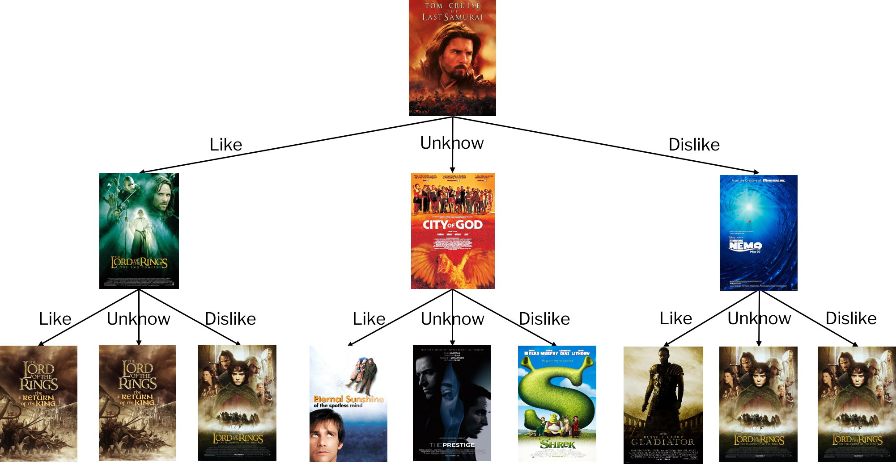

# Motivation

Watching movie is one of the most important forms of entertainment for most of people. People like many types of films, for example, documentaries, action films, suspense films, and so on. Many outstanding works have been brought to the screen by outstanding production teams to share and resonate with audiences. In the era of information explosion, pushing to users information matching their preference has been a valuable application and a major challenge in the field of data science. In this way, many websites have established sophisticated, reliable and highly accurate movie preference recommendation algorithms or systems. These algorithms or systems are a great invention that can efficiently satisfy people's need to watch movies and greatly reduce the time users need to search for movies. We want to simply try to make a demo movie recommendation system based on the [movielens](https://grouplens.org/datasets/movielens/latest/) dataset, a dataset consisting of users’ rating and tagging towards movies and will allow us to use almost everything we learned in data science this semester and force us to learn some new concepts and algorithms. We strongly believe that this is a very big challenge, but we do think this project is very meaningful and worthwhile.

# Related work

Haolin has previous exposure to the movielens dataset in his studies and has had some ideas about it. Shaocong, Yuxuan and Boqian all have some good knowledge of statistics, and are good at data analysis with R. At the same time, all of us hope to learn something new and complete the challenge through this project. We are eager to improve ourselves and with this thought in mind, we decide to complete this difficult project.

# Initial questions

# Data

# Exploratory analysis

# Additional analysis

### Identification of differentiable movies

We implemented adaptive bootstrapping algorithm [(Golbandi, N., et al. 2011)](https://dl.acm.org/doi/10.1145/1935826.1935910) to find movies significantly differentiate people of different taste. 

&nbsp;

According to user’s response to the given movie, the algorithm classifies users into three sub-groups: lovers $N^{+}$, haters $N^{-}$, and people unknown of the movie $\overline{N}$. We choose 3.5 as the cut-off to determine whether users are lovers or haters, as our exploratory analysis found that 3.5 is the median of all ratings. 

&nbsp;

The algorithm defined a term $D_{m}$, which is equal to the sum of subgroups’ standard deviation of ratings on other movies ($\space D(m) = \sigma_{u \in N^{+}(m)} + \sigma_{u \in N^{-}(m)} + \sigma_{u \in \overline{N}(m)} \space$), to measure movies’ differentiation ability. By the definition, the most differential movie, i.e. the best splitter, should have the lowest $D_{m}$, because bad splitters will divide people with different taste into the same sub-group, resulting in increased $D_{m}$. 

&nbsp;

Once the algorithm found the most differential movie for overall users, it will repeat the above process in the 3 sub-groups, Lovers, haters and people unknown of this movie, separately. This recursive process was thus named bootstrapping. Subsequently, the algorithm will build a structure similar to a decision tree whose nodes are movies. Our implementation constructed such a ternary tree structure with a depth of 3. The result can be interpreted by the figure below:

&nbsp;

For new users, let them rate on “The Last Samurai” at first. Users who give ratings above or equal to 3.5 are considered to be lovers, and those who give ratings below 3.5 are considered to be haters. Users can also reply that they haven’t watched this movie. For lovers, we then let them rate on “The Lord of the Rings: The Two Towers”, for haters we let them rate on “Finding Nemo”, and the unknown will be asked to rate on “City of God”. After rating on the second provided movie, users will then be asked to rate on the third movie which is also adaptively provided. 

&nbsp;

Since these movies significantly differentiate people of different taste, collection of user’s rating on them will allow us to generate more personalized recommendation.

&nbsp;

### User-similarity-based recommendation

A basic strategy for recommendation is, find users similar to the new user, and recommend the new user with what similar users like. Based on this strategy, a technique, collaborative filtering, was invented to making predictions (filtering) about the interests of a user by collecting preferences or taste information from many similar users (collaborating).

&nbsp;

This algorithm predict ratings with the following procedures:
-	Find X most similar users to the given user (Here we set X to 10)
-	Find all movies that these similar users have rated and the given user has not watched
-	Predict the given user’s ratings on these movies based on the similarity measure and ratings of similar users. The formula is:

$$
\hat{r}_{u m}=\bar{r}_{u}+\frac{\sum_{v \in S(u, K) \cap N(m)} w_{u v}\left(r_{v m}-\bar{r}_{v}\right)}{\sum_{v \in S(u, K) \cap N(m)}\left|w_{u v}\right|}
$$

In the above process, finding similar users and predicting ratings involve the measurement of similarity, $w_{uv}$. We considered two measurements, cosine similarity and Pearson correlation, and compared their performance through experimentation.

$$
\begin{align}
& \text{Cosine Similarity}: & w_{u v} = \frac{\sum_{m \in M} r_{u m} \cdot r_{v m}}{\sqrt{\sum_{m \in M}r_{u m}^{2} \cdot \sum_{m \in M}r_{v m}^{2}}}
\\
\\
& \text{Pearson Correlation}: & w_{u v} =\frac{ \sum_{m \in M}\left(r_{u m}-\bar{r}_{u}\right) \cdot\left(r_{v m}-\bar{r}_{v}\right)}{\sqrt{\sum_{m \in M}\left(r_{u m}-\bar{r}_{u}\right)^{2} \sum_{m \in M}\left(r_{v m}-\bar{r}_{v}\right)^{2}}}
\end{align}
$$

We performed 30 rounds of experiment. In each round, for each user, we randomly extract 20% records of their ratings as the test dataset, and the remained dataset as train dataset. Then, we use the two similarity measures separately to find similar users and subsequent predicted ratings on corresponding movies in the test dataset. Finally, we compute the RMSE between predicted ratings and actual ratings in the test data set, and get the two RMSE values.

&nbsp;

The [comparison between RMSE values](https://shaocongz.github.io/Final_Project/user_similarity.html#Compare_RMSE) of predictions based on the two measurement revealed that in this dataset, Pearson correlation is a better measurement which leads to smaller prediction error. Therefore, we implemented the algorithm with Pearson correlation in our shiny app.

&nbsp;

### Latent-factor-based recommendation

we built a latent factor model based on Funk-SVD to predict ratings for existing users in the dataset.

&nbsp;

Funk-SVD was named and authored by [Simon Funk](https://sifter.org/~simon/journal/20061211.html). The core idea of this algorithm is that decompose the user-movie sparse matrix $R$ into two matrix, the user feature matrix $P$ and the movie feature matrix $Q$ which satisfies $R = P \times Q^T$, then predicted rating by calculating $\displaystyle R_{um} = P_u \cdot Q^T_m$. Features are latent factors that we can't and don't have to directly measure or understand. 

&nbsp;

In human words, the interaction between a user's latent characteristics and a movie's latent characteristics decides the user's rating to the movie. Find values of these latent characteristics by decomposing the rating matrix, then predict ratings based on them.

&nbsp;

We implemented this algorithm and predicted ratings on the matrix constructed from the first 20 users and the first 20 movies in the dataset. To find $P$, $Q$, we generated two random matrix, and performed gradient descent to minimize the loss to let their product approximate the true rating matrix.

&nbsp;

In gradient descent, the loss function was defined as:

$$\displaystyle L(P, Q) = \sum_{(u, m) \in \text{Train}} \left(R_{um} - P_u \cdot Q^T_m \right)^2  + \lambda \sum_u||P_u||^2 + \lambda \sum_m ||Q_m||^2$$

By performing differentiation, we found the partial derivatives of loss to $P$ and to $Q$:

$$\frac {\partial}{\partial P_u}L = \sum_{m} 2(P_uQ_m^T - R_{um})Q_m + 2\lambda P_u \\ \frac {\partial}{\partial Q_m}L = \sum_{u} 2(P_uQ_m^T - R_{um})P_u + 2\lambda Q_m$$ 

Accordingly, we can update the value of $P$ and $Q$ in each round of gradient descent:

$$P_u := P_u - \alpha \frac {\partial L}{\partial P_u} \\ Q_m := Q_m - \alpha \frac {\partial L}{\partial Q_m}$$

Our train process on the train data [minimized the loss to approximately 0](https://shaocongz.github.io/Final_Project/SVD.html#Train). We further applied this
model to [predict ratings for NA value in the original rating matrix](https://shaocongz.github.io/Final_Project/SVD.html#Predict__Visualization). With the size of the matrix in the train data enlarges, the time cost for training this model accurately increases. Therefore, we didn't apply this model in our
shiny app or try to optimize this model.

&nbsp;

# Discussion