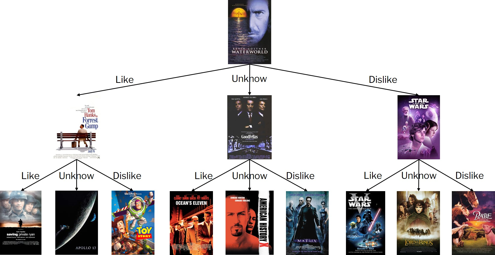

- Recommend movies for new users can be knotty since we have no prior data about new users. 

- One strategy to solve this problem is providing new users with some movies and let them feedback their interest in provided movies.

- What kind of movies should be provided to new users? Intuitively, these movies should be:
  - **Popular**: Users can't comment on movies they have never heard of.
  - **Controversial**: Movies unanimously praised can't differentiate users of different tastes.


## Tree-based bootstraping

- Here we adopted the tree-based bootstraping algorithm proposed by [Golbandi, N., et al. 2011.](https://dl.acm.org/doi/10.1145/1935826.1935910) to find movies meet above requirement.


## Dependencies

```{r}
library(dplyr, warn.conflicts = FALSE)

# Suppress summarise info
options(dplyr.summarise.inform = FALSE)

library(tidyverse)
```


## Data preparation

```{r}
path = "./data/small/ratings.csv"

rating_tidy = read_csv(path, col_types = "iinc") %>% 
  janitor::clean_names()

hot_movies = 
  rating_tidy %>% 
  count(movie_id) %>% 
  arrange(desc(n)) %>% 
  head(100) %>% 
  arrange(movie_id) %>% 
  pull(movie_id) %>% 
  as_vector()

rating_dscts = 
  rating_tidy %>% 
  select(-timestamp) %>% 
  filter(movie_id %in% hot_movies) %>% 
  pivot_wider(names_from = movie_id, values_from = rating) %>% 
  pivot_longer(cols = as.character(hot_movies), names_to = "movie_id", values_to = "rating")
```


## Function


### cut-off for being lover/hater/unknown

```{r}
classify = function(rating) {
  res = ""
  
  if (is.na(rating)) {
    res = "unknown"
  } else if (rating >= 3.5) {
    res = "lover"
  } else {
    res = "hater"
  }
  
  return(res)
}

```

### classify

```{r}
user_cate =
  rating_dscts %>%
  mutate(type = map(rating, classify)) %>% 
  unnest(type) %>% 
  mutate(movie_id = as.numeric(movie_id))
```

### calculate differentiation score

```{r}
calc_score = function(data, id){
  
  user_movie_type = 
    data %>% 
    filter(movie_id == id) %>% 
    select(user_id, type)

  score = 
    data %>% 
    select(-type) %>% 
    left_join(user_movie_type, by = "user_id") %>% 
    filter(movie_id != id) %>% 
    group_by(type, movie_id) %>% 
    summarize(var = var(rating, na.rm = TRUE)) %>% 
    pull(var) %>% 
    sum(na.rm = TRUE)
  
  return(score)
}

```

## Tree

We use ternary tree to save our result.

```{r, warning=FALSE}
setClass("movieTreeNode",
  slots = c(
    mid = "numeric",
    sub_lover = "movieTreeNode",
    sub_unknown = "movieTreeNode",
    sub_hater = "movieTreeNode"
  ) 
)
```


## Main function

```{r}
find_movies = function(data, levels, root){
  if (levels == 0 || nrow(data) == 0) {
    return(root)
  }
  
  movies = 
    data %>% 
    pull(movie_id) %>% 
    as_vector() %>% 
    as.integer()
  
  scores = list()
  for (i in 1:length(movies)) {
    scores[[i]] = calc_score(data, movies[[i]])
  }
  
  scores = as_vector(scores) %>% as.numeric()
  ind = which(scores == min(scores))[1]
  movie = movies[ind]
  
  root@mid = movie

  
  lovers = 
    data %>%
    filter(movie_id == movie, type == "lover") %>% 
    pull(user_id) %>% 
    as.integer()
    
  lovers_data = 
    data %>% 
    filter(user_id %in% lovers) %>% 
    filter(movie_id != movie)
    
  haters =
    data %>%
    filter(movie_id == movie, type == "hater") %>% 
    pull(user_id) %>% 
    as.integer()
  
  haters_data = 
    data %>% 
    filter(user_id %in% haters) %>% 
    filter(movie_id != movie)
    
  unknowns = 
    data %>%
    filter(movie_id == movie, type == "unknown") %>% 
    pull(user_id) %>% 
    as.integer()
    
  unknowns_data =
    data %>% 
    filter(user_id %in% unknowns) %>% 
    filter(movie_id != movie)
    
  root@sub_lover = find_movies(lovers_data, levels - 1, new("movieTreeNode"))
  root@sub_unknown = find_movies(unknowns_data, levels - 1, new("movieTreeNode"))
  root@sub_hater = find_movies(haters_data, levels - 1, new("movieTreeNode"))
  
  return(root)
}

```


## level-order traversal

```{r}
dfs = function(root, level, res){
  
  if (length(res) < level) {
    res[[level]] = list()
  }
  
  if (identical(root@mid, numeric(0))) {
    # increasing the readability of future traversal result
    # by using -1 of the null node value
    res[[level]] = append(res[[level]], -1)
    return(res)
  }
  
  res[[level]] = append(res[[level]], root@mid)
  
  res = dfs(root@sub_lover, level + 1, res)
  res = dfs(root@sub_unknown, level + 1, res)
  res = dfs(root@sub_hater, level + 1, res)
  
  return(res)
}

```


## Test

- For testing, we perform the bootstrapping on 5000 rows of sampled data, generate the ternary tree, and retrive movies thorugh level order traversal.

```{r, message=FALSE, warning=FALSE, echo=FALSE}
root = find_movies(sample_n(user_cate, 5000), 3, new("movieTreeNode"))
res = dfs(root, 1, list())

# The last element must be a list made up of several -1, so we directly discard it.
res = res[1:length(res) - 1]

res

```


## Running on the whole dataset

- Here is the code we used to perform the bootstrapping on the whole dataset.

- The calculation is not perform while knitting this document due to large time cost. We performed calculation in advance, and recorded the result (showed in the following section).

```{r, eval=FALSE}
root = find_movies(user_cate, 3, new("movieTreeNode"))
res = dfs(root, 1, list())

# The last element must be a list made up of several -1, so we directly discard it.
res = res[1:length(res) - 1]

res
```

## Result on the overall dataset

- After perform on the overall dataset, we find the following movies have the highest differentiation score.

```{r}
result = list(list(208), list(356, 1213, 260), list(2028, 150, 1, 4963, 2329, 2571, 1196, 4993, 34))
movies = c(as_vector(result[[1]]), as_vector(result[[2]]), as_vector(result[[3]]))
movie_seq = 1:13

movies_df = tibble(seq = movie_seq, movie_id = movies)

movie_info = read_csv("./data/small/movies.csv") %>% 
  janitor::clean_names()

movie_info %>% 
  filter(movie_id %in% movies) %>% 
  left_join(movies_df) %>% 
  arrange(seq) %>% 
  select(-seq) %>% 
  kableExtra::kbl() %>% 
  kableExtra::kable_styling()
  
```


- According to the result, when facing new users, we can let them show their preference for above movies:



